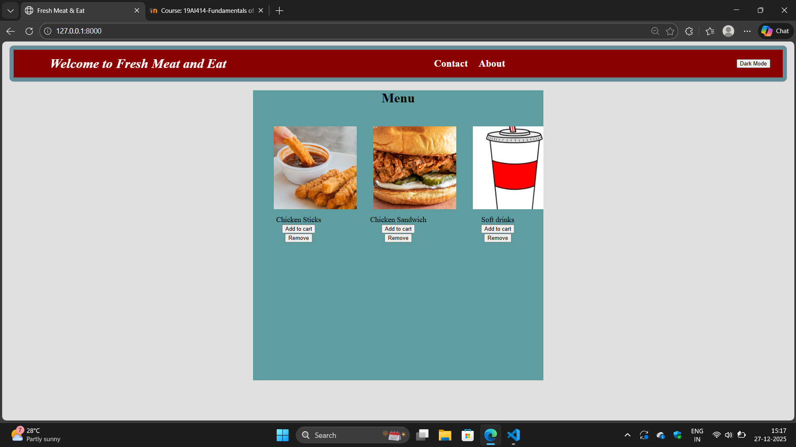
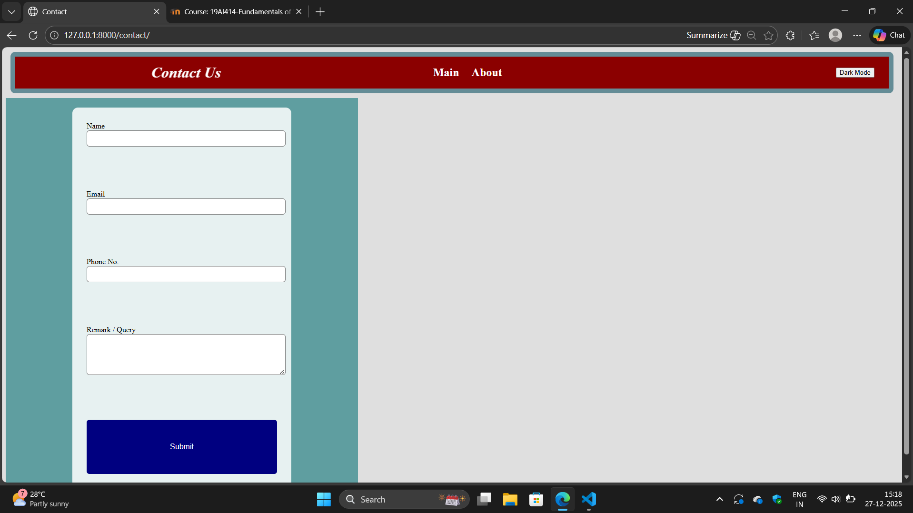
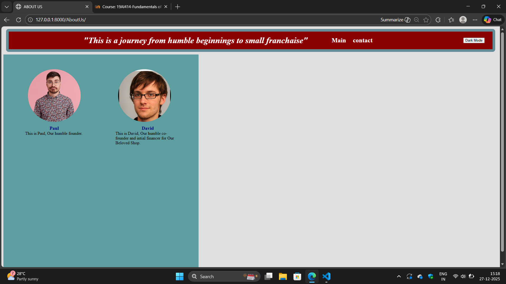

# Ex.07 Restaurant Website
## Date:

## AIM:
To develop a static Restaurant website to display the food items and services provided by them.

## DESIGN STEPS:

### Step 1:
Requirement collection.

### Step 2:
Creating the layout using HTML and CSS.

### Step 3:
Updating the sample content.

### Step 4:
Choose the appropriate style and color scheme.

### Step 5:
Validate the layout in various browsers.

### Step 6:
Validate the HTML code.

### Step 7:
Publish the website in the given URL.

## PROGRAM:
```
AboutUs.html
<!DOCTYPE html>
<html>
    
    <head>
    <title>ABOUT US</title>
    <link rel="stylesheet" href="">
</head>
<body>
    <header class="site-header"><em>"This is a journey from humble beginnings to small franchaise"</em>
<nav>
    <a href=''>Main</a>
    <a href=''> contact</a>
</nav>
<button id="themeToggle" style="margin-left:20px;">
    Dark Mode
</button>

</header>
    </header>
    <div class="container">
    <figure>
        
        <figcaption>Paul</figcaption>
        This is Paul, Our humble founder.
    </figure>

    <figure>
        
        <figcaption>David</figcaption>
        This is David, Our humble co-founder and intial financer for Our Beloved Shop.
    </figure>

    </div>
</body>
<script>
const toggleBtn = document.getElementById("themeToggle");

toggleBtn.addEventListener("click", () => {
    document.body.classList.toggle("dark");

    toggleBtn.textContent =
        document.body.classList.contains("dark")
        ? "Light Mode"
        : "Dark Mode";
});
</script>

</html>

contact.html
<!DOCTYPE html>
<html>
<head>
    <title>Contact</title>
    
    <link rel="stylesheet" href="">
</head>
<body>

<header class="site-header">
    <em>Contact Us</em>
<nav>
    <a href=''>Main</a>
    <a href=''> About</a>
</nav>
<button id="themeToggle" style="margin-left:20px;">
    Dark Mode
</button>

</header>
</header>

<div class="container">
    <form class="contact-form" method="post">
        

        <label>
            Name<br>
            <input type="text" name="name" required>
        </label>

        <label>
            Email<br>
            <input type="email" name="email" required>
        </label>

        <label>
            Phone No.<br>
            <input type="tel" name="phone">
        </label>

        <label>
            Remark / Query<br>
            <textarea name="remark" rows="4"></textarea>
        </label>

        <button type="submit">Submit</button>
    </form>
</div>

</body>
<script>
const toggleBtn = document.getElementById("themeToggle");

toggleBtn.addEventListener("click", () => {
    document.body.classList.toggle("dark");

    toggleBtn.textContent =
        document.body.classList.contains("dark")
        ? "Light Mode"
        : "Dark Mode";
});
</script>

</html>

home.html

<!DOCTYPE html>
<html>
<head>
    <title>Fresh Meat  & Eat</title>
    <link rel="stylesheet" href="" >
</head>

<body>
<header class="site-header"><em> Welcome to Fresh Meat and Eat</em>
<nav>
    <a href=''>Contact</a>
    <a href=''> About</a>
</nav>
<button id="themeToggle" style="margin-left:20px;">
    Dark Mode
</button>

</header>

<div class=" restappmenu"><h1>Menu</h1><div>
    <figure> 
    <figcaption>Chicken Sticks</figcaption>
    <button class="Add" name="Add">Add to cart</button>
    <button class="Remove" name="Remove">Remove</button>
</figure>
<figure> 
    <figcaption>Chicken Sandwich</figcaption>
    <button class="Add" name="Add">Add to cart</button>
    <button class="Remove" name="Remove">Remove</button>
</figure>
<figure> 
    <figcaption>Soft drinks</figcaption>
    <button class="Add" name="Add">Add to cart</button>
    <button class="Remove" name="Remove">Remove</button>
</figure>

</div>
</div>
</body>
<script>
const toggleBtn = document.getElementById("themeToggle");

toggleBtn.addEventListener("click", () => {
    document.body.classList.toggle("dark");

    toggleBtn.textContent =
        document.body.classList.contains("dark")
        ? "Light Mode"
        : "Dark Mode";
});
</script>

</html>

style.css

body{
    background-color:rgba(150,150,150,0.3);
}
header{
    text-align: center;
    font-size: x-large;
    font-weight: bold;
    background-color: rgba(90,160,190);
    padding:10px;
    border:10px solid rgba(100,140,150);
    border-radius: 10px;  
    margin:10px
}
.restappmenu{
      width:700px;
      height:700px;
      background-color: cadetblue;
      margin: auto;
}
.site-header {
    display: flex;
    justify-content: space-between;
    align-items: center;
    background-color: #8b0000;
    padding: 15px 30px;
    color: white;
}

.site-header nav a {
    color: white;
    text-decoration: none;
    margin-left: 20px;
    font-weight: bold;
}

.site-header nav a:hover {
    text-decoration: underline;
}

@keyframes animation1{
    0%{
        transform:translateX(500px) ;
    }
    100% {
     transform: translateX(0px);   
    }
}
.site-header em{
    position:relative;
    animation-name:animation1;
    animation-duration: 3s;
    animation-iteration-count: infinite;
    animation-direction: alternate;
    animation-delay:1ms;
    font-size: xx-large;
}
.restappmenu{
    text-align: center;
}
.restappmenu div {
    display: grid;
    grid-template-columns: repeat(auto-fit, minmax(200px, 1fr));
    background-color: cadetblue;
    gap: 20px; /* space between items */
    justify-content: center; /* optional centering */
    text-align: center;
    font-size: large;
    overflow:hidden;
}

.restappmenu div figure img{
    width:200px;
    height:200px;
    margin:10px;
    object-fit:cover;
}
.container {
    background-color: cadetblue;
    width: 700px;
    min-height: 800px;
    display: grid;
    grid-template-columns: repeat(auto-fit, minmax(200px, 1fr)); /* horizontal layout */
    gap: 10px;              /* space between figures */
    justify-items: center;   /* center each figure in its column */
    padding: 20px;
}

.container figure{
    padding:10px;

}
.container figcaption{
    text-align: center;
    font-size: large;
    font-weight: bold;
    color:navy;   
}
.container figure img{
    width: 200px;
    height:200px;
    object-fit: cover;
    border:10px solid cadetblue;
    border-radius: 200px;
}
.contact-form {
    background-color: rgba(255,255,255,0.85);
    padding: 30px;
    border-radius: 12px;
    width: 100%;
    max-width: 400px;
    display: grid;
    gap: 15px;
}

.contact-form input,
.contact-form textarea {
    width: 100%;
    padding: 8px;
    border-radius: 6px;
    border: 1px solid #777;
    font-size: 14px;
}

.contact-form button {
    padding: 10px;
    background-color: navy;
    color: white;
    border: none;
    border-radius: 6px;
    font-size: 16px;
    cursor: pointer;
}

.contact-form button:hover {
    background-color: #000066;
}
body.dark {
    background-color: #1e1e1e;
    color: #f0f0f0;
}

body.dark .site-header {
    background-color: #222;
}

body.dark .container {
    background-color: #2e2e2e;
}

body.dark .contact-form {
    background-color: #3a3a3a;
}

body.dark input,
body.dark textarea {
    background-color: #555;
    color: white;
    border: 1px solid #888;
}

body.dark button {
    background-color: #444;
    color: white;
}


```


## OUTPUT:



## RESULT:
The program for designing software company website using HTML and CSS is completed successfully.
